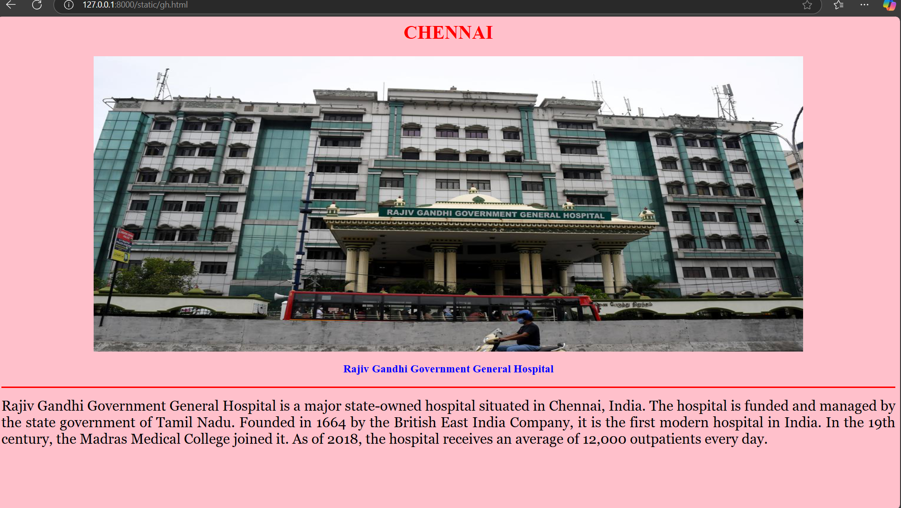
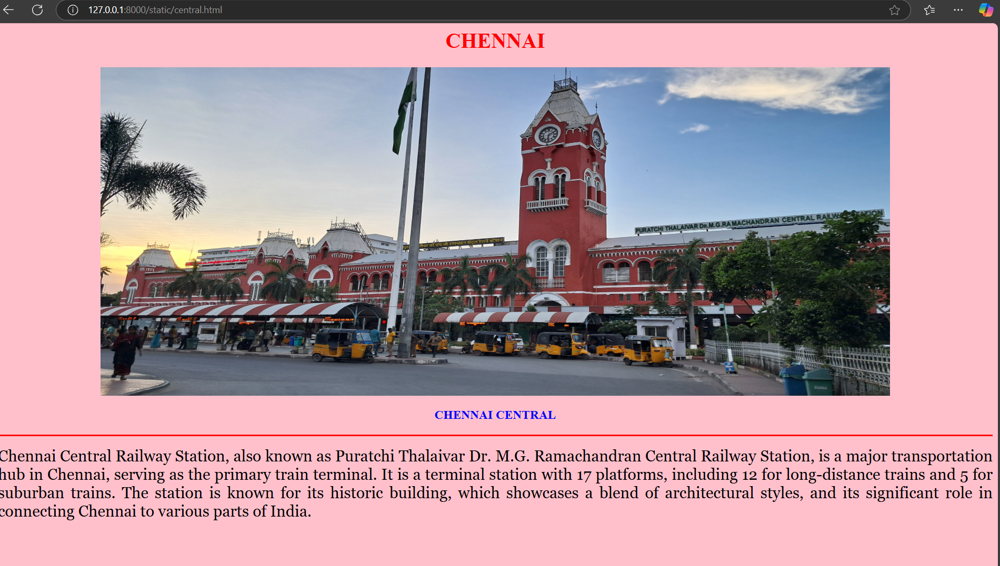
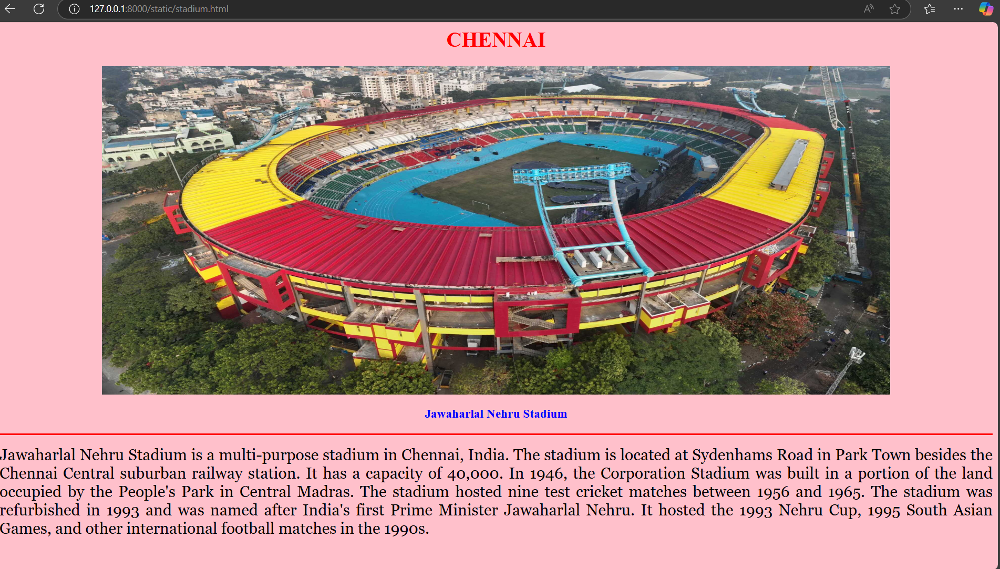
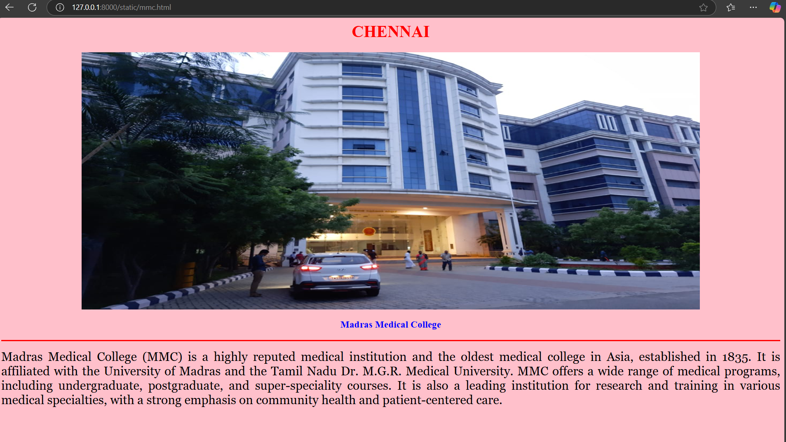

# Ex04 Places Around Me
# Date:14-04-2025
# AIM
To develop a website to display details about the places around my house.

# DESIGN STEPS
## STEP 1
Create a Django admin interface.

## STEP 2
Download your city map from Google.

## STEP 3
Using <map> tag name the map.

## STEP 4
Create clickable regions in the image using <area> tag.

## STEP 5
Write HTML programs for all the regions identified.

## STEP 6
Execute the programs and publish them.

# CODE
```
map.html

<html>

<head>

<title>My City</title>

</head>

<body>

<h1 align="center">

<font color="red"><b>CHENNAI</b></font>

</h1>

<h3 align="center">

<font color="blue"><b>Jayasurya B (24001758)</b></font>

</h3>

<center>


<map name="MyCity">

<area shape="rect" coords="630,400,900,500" href="home.html" title="My Home">
<area shape="cricle" coords="570,350,600,450" href="central.html" title="CENTRAL">
<area shape="cricle" coords="400,200,550,300" href="stadium.html" title="Jawaharlal Nehru Stadium">
<area shape="cricle" coords="400,500,550,650" href="mmc.html" title="madras medical college">
<area shape="cricle" coords="1000,550,850,370" href="gh.html" title="Goverment Hospital">
</map>
</center>
</body>
</html>

central.html

<html>

<head>

<title>My Home Town</title>

</head>

<body bgcolor="pink">

<h1 align="center">

<font color="red"><b>CHENNAI</b></font>

</h1>
<center>

</center>
<h3 align="center">

<font color="blue"><b>CHENNAI CENTRAL</b></font>

</h3>

<hr size="3" color="red">

<p align="justify">

<font face="Georgia" size="5">
    Chennai Central Railway Station, also known as Puratchi Thalaivar Dr. M.G. Ramachandran Central Railway Station, is a major transportation hub in Chennai, serving as the primary train terminal. It is a terminal station with 17 platforms, including 12 for long-distance trains and 5 for suburban trains. The station is known for its historic building, which showcases a blend of architectural styles, and its significant role in connecting Chennai to various parts of India. 
</p>

</body>

</html>

gh.html

<html>

<head>

<title>My Home Town</title>

</head>

<body bgcolor="pink">

<h1 align="center">

<font color="red"><b>CHENNAI</b></font>

</h1>
<center>
    

</center>

<h3 align="center">

<font color="blue"><b>Rajiv Gandhi Government General Hospital</b></font>

</h3>

<hr size="3" color="red">

<p align="justify">

<font face="Georgia" size="5">
    Rajiv Gandhi Government General Hospital is a major state-owned hospital situated in Chennai, India. The hospital is funded and managed by the state government of Tamil Nadu. Founded in 1664 by the British East India Company, it is the first modern hospital in India. In the 19th century, the Madras Medical College joined it. As of 2018, the hospital receives an average of 12,000 outpatients every day.

</body>

</html>

stadium.html

<html>

<head>

<title>My Home Town</title>

</head>

<body bgcolor="pink">

<h1 align="center">

<font color="red"><b>CHENNAI</b></font>

</h1>
<center>
    
</center>

<h3 align="center">

<font color="blue"><b>Jawaharlal Nehru Stadium</b></font>

</h3>

<hr size="3" color="red">

<p align="justify">

<font face="Georgia" size="5">
    Jawaharlal Nehru Stadium is a multi-purpose stadium in Chennai, India. The stadium is located at Sydenhams Road in Park Town besides the Chennai Central suburban railway station. It has a capacity of 40,000.

In 1946, the Corporation Stadium was built in a portion of the land occupied by the People's Park in Central Madras. The stadium hosted nine test cricket matches between 1956 and 1965. The stadium was refurbished in 1993 and was named after India's first Prime Minister Jawaharlal Nehru. It hosted the 1993 Nehru Cup, 1995 South Asian Games, and other international football matches in the 1990s.

</p>

</body>

</html>

mmc.html

<html>

<head>

<title>My Home Town</title>

</head>

<body bgcolor="pink">

<h1 align="center">

<font color="red"><b>CHENNAI</b></font>

</h1>
<center>
    
</center>
<h3 align="center">

<font color="blue"><b>Madras Medical College</b></font>

</h3>

<hr size="3" color="red">

<p align="justify">

<font face="Georgia" size="5">
    Madras Medical College (MMC) is a highly reputed medical institution and the oldest medical college in Asia, established in 1835. It is affiliated with the University of Madras and the Tamil Nadu Dr. M.G.R. Medical University. MMC offers a wide range of medical programs, including undergraduate, postgraduate, and super-speciality courses. It is also a leading institution for research and training in various medical specialties, with a strong emphasis on community health and patient-centered care. 
</p>

</body>

</html>

```
# OUTPUT







# RESULT
The program for implementing image maps using HTML is executed successfully.
